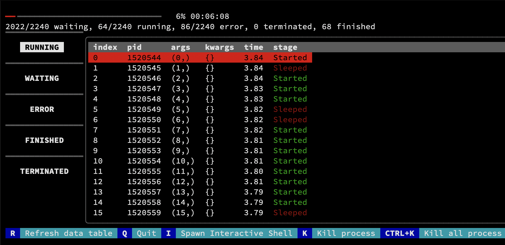

# RichPool

A more powerful multiprocessing library, which can visualize and interactive with your Pool.

[example.py](./example.py) can demonstrate basic usage.

# Install

```bash
pip install git+https://github.com/kongjiadongyuan/RichPool.git
```

# Screenshot

